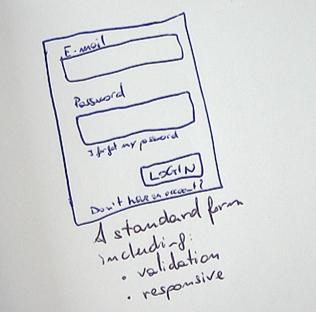

How to design an SSO service: thinking about how the front-end and the back-end developer will use it.

## Why another SSO service 😁

In ButOpen we have fun creating Open Source software.

What we have noticed is that every time we create a new project from scratch, we need to include a user management
system for **authentication and authorization**.

There are several products for SSO (Single Sign-On), but none met our needs:

1) can be integrated into a Front-end project with very few lines of code
2) Open-source (of course 😉 )
3) Extendable with plugins
4) Activated in a few seconds on the cloud or on-premise
5) Allowing the management of roles (as simple strings) and additional information saved as a JSON

Existing solutions are cumbersome and too complex for the simple use cases we needed.

Therefore, we decided to take the experience used in all past projects and create an open solution that, starting from
our previous code, can provide a modern, simple, and fast system of SSO to integrate into our current and future
projects.

**And make it available to the entire open source community.**

SSONext was born.

In this post, we talk about the design process, since in ButOpen when creating a new project we first focus on what **
implementation choices** to make in order to satisfy those who will use it.

## Front-end: looking for the fastest way to integrate it 😎


The goal of an SSO system for the front-end developer is to have **a form that allows to login**. 

The front-end dev may prefer one of these solutions:
1) Use an already available form as a web component
2) Use the sso-next APIs to login, register, reset password, forgot password, ...

### Providing a web component 
For the first point, the ideal solution for the developer is to integrate a tag that includes the login form.
Let's say a 
``` html
<sn-login> </sn-login>
``` 
tag to use into our HTML code.


When the user logs in, a token is automatically saved in the localStorage to be used in HTTP calls.

For a basic project, this is more than enough. 

In more complex projects, the front-end developer would like to have 
the ability to extend the `<sn-login>` tag with a series of handlers attached to the most common events:
- on-error
- on-login
- on-register
- on-token

### Providing some SSO APIs

If the front-end developer likes to have full control on the login and register forms, then providing API would be 
a better solution.

The APIs would allow to:
1) login using an endpoint similar to this: 

POST /api/login 
```js
{email: "", password: ""}
```

2) register using and endpoint like this: 

POST /api/register 
```js
{email: "", name: "", surname: "", password: "", roles: ["user"], info: {...}}
```

And then an API to allow password reset.

## Back-end: looking for the fastest way to integrate it 😏

The backend developer needs to understand if a token is valid or not.
In addition, the developer may need to search for a user or a list of users.
Therefore we will provide the developer with an API to integrate into the backend code with a simple copy/paste.

This API will allow him to:
- verify that a token is valid
- search for a user (or a list)
- register an endpoint to call when backend events occur (webhook)

The strength of a simple service lies in the immediacy of use. 

If the code to include consists of a few lines, then everything is easier.

Our challenge will be then to reduce it to a very few lines, obtaining a result like this:

```typescript

const jwt = require('jsonwebtoken');

export class SSONextApi {
    
    private basePath = "https://ssonext.com/v0/api/MY_API_CODE"
    
    private password:string
    
    private async request(path:string){
        return await (await fetch(basePath + path)).json()
    }
    
    async validateToken(token:string){
        if(!this.password){
          this.password = (await this.request("/password")).password  
        }
        return jwt.verify(token, this.password)
    }

    async roles(token:string): string[] {
        const tdata = this.validateToken(token);
        const roles = tdata && tdata.roles ? tdata.roles : [];
        return roles;
    }

    async findUserByEmail(email: string) {
        return (await this.request(`/user?email=${email}`)).users
    }

    async deleteUser(email: string) {
        //...
    }

    async allUsers(page = 0, size = 10) {
        //...
    }
    
    async updateUserRoles(email: string, roles: string[]){
        //...
    }

    async updateUserNameSurname(email: string, name: string, surname: string) {
        //...
    }
    
}


```

The idea is that if the developer can copy/paste the source code, customizing it based on his/her own needs 
is a matter of seconds.

The alternative can be a module available through NPM, exposing the same features.

Notes: 
- some methods require the token as input and operate synchronously, without asking anything to SSONext 
(in the code above the verification will be synchronous: it will be asynchronous only the first time!)
- here the code is in TypeScript, but we can allow copying in the language the developer prefers (or copy the endpoints only)

This will be the first version of SSONext. You will find it soon in the [butopen repo](https://github.com/butopen).

